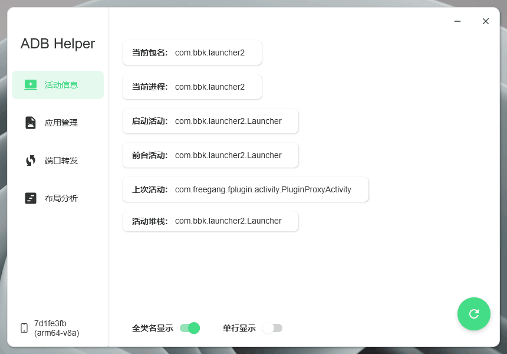
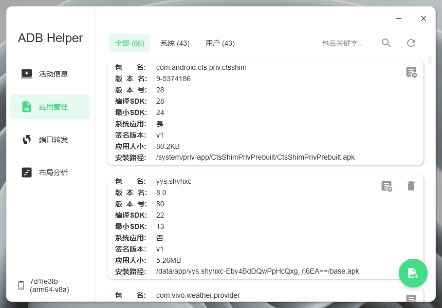
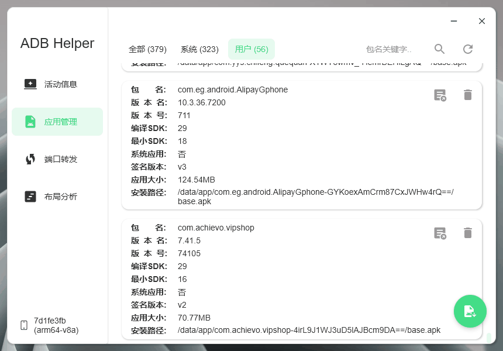
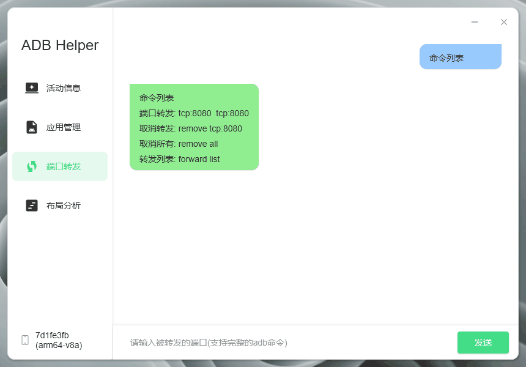
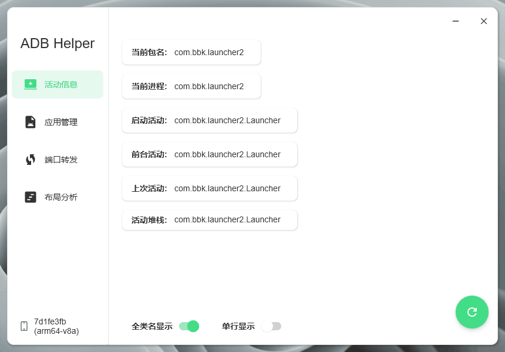
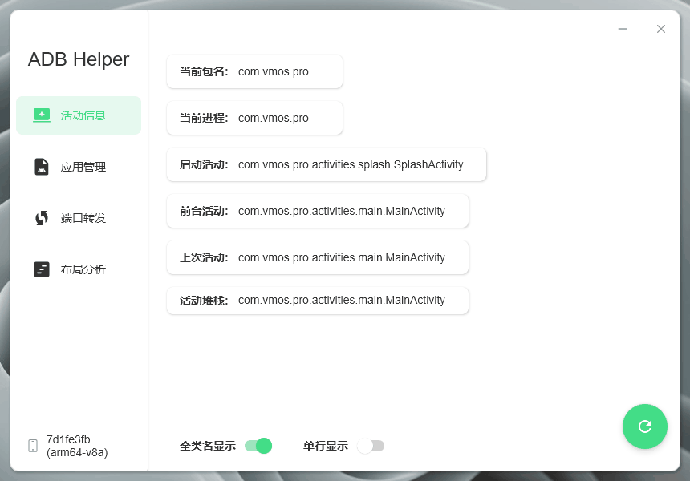

# AdbHelper

使用 `Jetpack Compose For Desktop` 编写的` Android ADB便携式工具`。

> 1、当前运行App的基本信息

> 2、应用列表、管理、安装

> 3、adb基本命令操作

> 4、布局信息解析、搜索

> 5、多设备切换

* 通过`Runtime`执行 `Command` 命令。

* 编译环境：

  > jdk-18.0.2.1
  >
  > IntelliJ IDEA 2022.2.3
